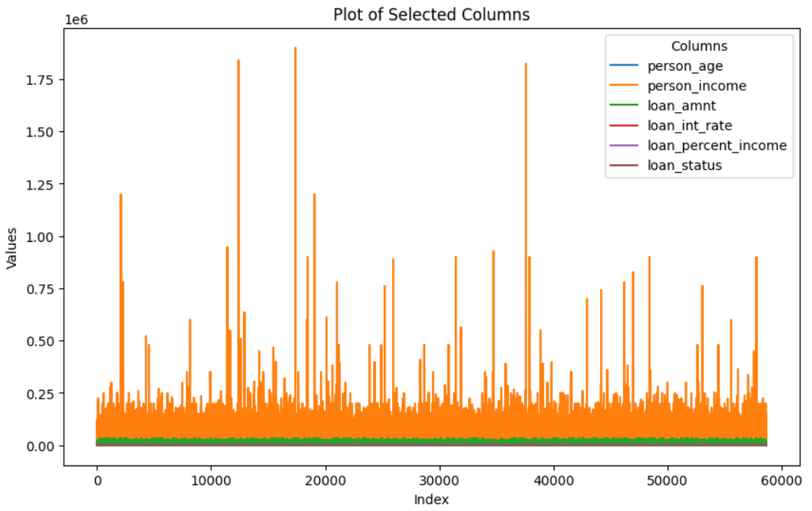

# ACIT4620-24H-G6
AI, fuzzy logic Project

# Data source: 
Employment history feature: 
https://www.kaggle.com/competitions/playground-series-s4e10/data?select=train.csv&fbclid=IwZXh0bgNhZW0CMTEAAR3m8MTqUNOmYlHeO4aSG3t27BQAZmFUhklp47HlrgQKs-a_jqKvER8MLxI_aem_wnn0vq8GNdEFy5I6HQg8XA

Credit score dataset feature: 
https://www.kaggle.com/datasets/architsharma01/loan-approval-prediction-dataset?fbclid=IwZXh0bgNhZW0CMTEAAR3qB690tKMRmu3WPfOR3JX_uWnwWm5UZ8egilKtbPSOXpd80po5694E-Ew_aem_y6J4ieYEDtECW1CeA750dQ

# Project Environment
1. Python 3
2. scikit-learn for classification, regression, clustering, dimensionality reduction.
2. scikit-fuzzy -U for working with fuzzy systems.
3. networkx for the creation, manipulation.
4. keras for building and training deep learning models.
5. NumPy for numerical computations.
6. Pandas for data manipulation and analysis.
7. Requests for the process of sending and receiving data from websites.
8. Matplotlib for plotting results.
9. TensorFlow/PyTorch for more advanced RL algorithms like DQN.
10.Pymoo for for multi-objective optimization algorithms.

imports to run the files:
- $ python3 -m pip install scikit-fuzzy
- $ $ pip install networkx

# Results

